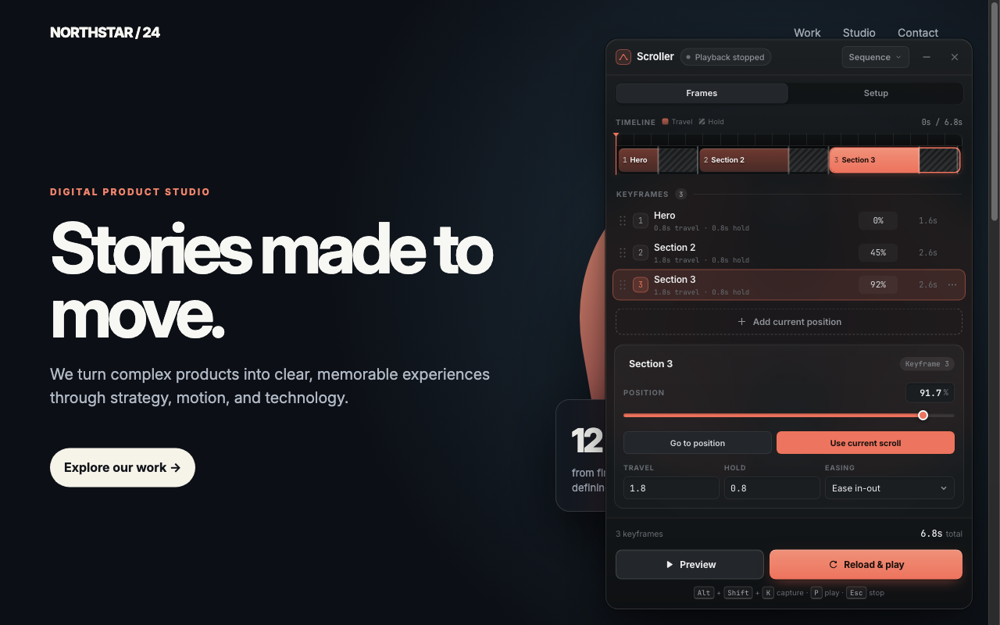

# Scroller

Design smooth, repeatable webpage scrolls for product demos, walkthroughs, and social videos—directly on the page you want to record.

Scroller is a lightweight Chrome extension that captures scroll positions as keyframes. Set the travel and hold time for each frame, choose an easing curve, and preview or loop the resulting sequence while recording your screen.



## Features

- Capture, rename, reorder, duplicate, update, and delete scroll keyframes.
- Edit travel and hold timing on a proportional timeline.
- Choose cinematic, editorial, product, or quick pacing presets.
- Scrub the timeline to preview intermediate positions.
- Resize the browser to common desktop, laptop, tablet, and mobile viewports.
- Compose for 16:9, 4:5, 9:16, or 1:1 with optional safe-area guides.
- Optionally reload the page before a sequence starts, so recordings include the page load animation.
- Move and resize the in-page control panel; layouts are remembered per page.
- Keep every sequence on your device. Scroller has no account, analytics, or server.

## Install

### Chrome Web Store

The public store link will be added here after the first listing is approved.

### Install from source

1. Download or clone this repository.
2. Open `chrome://extensions` in Chrome.
3. Enable **Developer mode**.
4. Select **Load unpacked** and choose the repository folder.
5. Open a normal website and select the Scroller toolbar icon.

Chrome does not allow extensions to run on protected pages such as `chrome://extensions`, the Chrome Web Store, or some browser-owned tabs.

## Recording workflow

1. In **Setup**, choose a viewport and select **Resize**. Optionally enable a safe crop guide.
2. Scroll to the first section and select **Add current position**. Repeat for the remaining sections.
3. Apply a pacing preset or edit each frame on the timeline and in the inspector.
4. Drag a clip along the timeline to reorder it. Duplicate or delete the selected keyframe from the inspector header.
5. Scrub the timeline ruler to preview the motion.
6. Start your screen recorder, then select **Start**. Press `Esc` to stop playback.
7. Enable **Reload first** next to **Start** to reload the page before the sequence runs, so the recording includes the page load animation without showing Scroller. The start delay counts down before the reload, and playback begins as soon as the page is ready. The choice is saved with the page's timeline.

## Timeline editing

Each keyframe is a clip with two parts: a solid **travel** block and a hatched **hold** block, sized in proportion to the full sequence.

- Drag the boundary between travel and hold to change the arrival time.
- Drag the right edge of the hold block to change the pause.
- Hold `Shift` while dragging for 10 ms precision instead of 50 ms steps.
- Select any clip to open its keyframe inspector.
- Drag a clip sideways to move it earlier or later in the sequence.
- Drag the ruler above the clips to scrub the page.

Timing values are clamped between 0 and 60 seconds. The inspector fields remain available when exact values are easier.

## Keyboard shortcuts

- `Alt` + `Shift` + `K`: capture the current scroll position.
- `Alt` + `Shift` + `P`: play or stop the sequence.
- `Esc`: stop playback.

Chrome shortcuts can be changed at `chrome://extensions/shortcuts`.

## Privacy and permissions

Scroller stores the current page origin and path, your keyframes, and interface preferences locally in Chrome so each page can restore its own sequence. Nothing is transmitted to the developer or a third party, and Scroller does not read page content. See the full [Privacy Policy](PRIVACY.md).

The extension requests only the permissions needed for its visible features:

- `activeTab`: work on the page only after you select Scroller or use its shortcut.
- `scripting`: inject the in-page keyframe editor into that active tab.
- `storage`: save timelines locally and carry a short-lived flag across a **Reload first** start.

Scroller does not request access to every website and does not run persistently on pages.

## Development

Scroller is a dependency-free Manifest V3 extension. The runtime is intentionally small:

- `manifest.json` defines the extension, permissions, icons, and shortcuts.
- `background.js` handles toolbar actions, commands, viewport resizing, and reload playback.
- `content.js` contains the Shadow DOM interface, timeline state, and animation engine.
- `icons/` contains the packaged extension icons.

Validate and package a release with:

```sh
./scripts/package-extension.sh
```

The script validates the manifest and JavaScript, reads the release version from the manifest, and writes an upload-ready ZIP to `dist/`.

## Support

Found a bug or have an idea? [Open a GitHub issue](https://github.com/metalstorm22/Scroller/issues).
